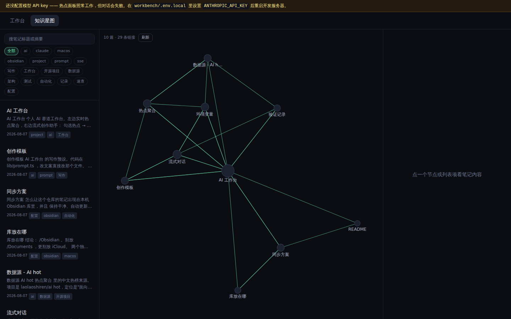

# AI 工作台

顶部两个视图切换：**工作台**（左边实时 AI 热点聚合，右边流式创作助手，勾选热点 → 选模板 → 直接出稿）和**知识星图**（读本机 Obsidian vault，把笔记的双链画成关系图，点节点或正文里的 `[[链接]]` 都能跳转）。




## 快速开始

```bash
cd workbench
npm install
cp .env.example .env.local   # 填 ANTHROPIC_API_KEY
npm run dev                  # http://localhost:3000
```

**没有 API key 也能跑** —— 热点面板照常工作，只有对话会失败，页面顶部会提示去配置。

## 配 API key

打开 `.env.local`，二选一：

```bash
# 方案 A：Claude（默认 claude-opus-5）
ANTHROPIC_API_KEY=sk-ant-xxx

# 方案 B：任何 OpenAI 兼容接口 —— DeepSeek / Kimi / 通义 / 本地 vLLM 都行
OPENAI_API_KEY=sk-xxx
OPENAI_BASE_URL=https://api.deepseek.com/v1
OPENAI_MODEL=deepseek-chat
```

两个都配了会优先用 Claude，想强制切换设 `LLM_PROVIDER=anthropic|openai`。改完 `.env.local` 要重启 dev server。

## 热点数据源

默认开箱即用、不需要任何 key 的五类源：

| 源 | 内容 | 热度依据 |
| --- | --- | --- |
| **AI 热榜** | [AI hot](https://github.com/laolaoshiren/ai-hot) 的中文 AI 热榜 + 每日简报 | 项目自带 score |
| Hacker News | 近 3 天 AI 相关、>20 分的帖子 | points |
| GitHub | 近 60 天新建、>100 star 的 AI 仓库 | star 数 |
| arXiv | cs.AI / cs.LG / cs.CL 最新论文 | 发布时间 |
| RSS | 量子位、机器之心（可换） | 榜位 + 时间 |

所有源**并行拉取、单独容错**：某个源挂了只会在面板上标红一个 `!`，其余照常出结果。热度分统一压到 0–100（log 归一，避免一个 5 万 star 的仓库把榜单压平），再叠加时间衰减：24 小时内不衰减，之后一周内线性降到 40%。结果按 URL 去重，服务端缓存 5 分钟，前端每 5 分钟自动刷新。

### AI 热榜（已接入，零配置）

[AI hot](https://github.com/laolaoshiren/ai-hot) 每 6 小时把榜单写回自己仓库的 `data/` 目录，所以**不需要部署它的服务**——直接读 raw.githubusercontent 上的 JSON 就行，开箱可用。用到两个文件：

- `data/hot.json` → 热榜条目（新闻 / 工具 / 项目 / 模型），带 score、来源、AI 摘要、分类标签
- `data/briefing.json` → 每日 AI 简报，渲染成榜单顶部那张卡片

只有换 fork、换镜像或想关掉它才需要配置：

```bash
AIHOT_REPO=laolaoshiren/ai-hot          # 换成你自己的 fork
AIHOT_BRANCH=main
AIHOT_BASE_URL=https://example.com/data # 直接指定放 hot.json / briefing.json 的目录
AIHOT_ENABLED=false                     # 关掉
```

适配代码在 `lib/sources/aihot.ts`，字段是照着真实数据写的（`hot_list` / `items` / `top_20` 三个键都认，取到哪个用哪个）。

### 换 RSS 源

```bash
HOT_RSS_FEEDS='量子位|https://www.qbitai.com/feed,新智元|https://xxx/feed'
```

RSS 2.0 和 Atom 两种格式都支持。

## 创作模块

勾选的热点会连同标题、来源、时间、摘要一起拼进 system prompt。上方 5 个模板（自由对话 / 推特长文 / 公众号 / 短视频脚本 / 深度拆解）各自追加一段写作要求，模板文案都在 `lib/prompt.ts` 里，直接改就行。

对话是真正的流式：服务端 SSE 逐 token 推，前端逐字渲染，支持中途「停止」。Enter 发送，Shift+Enter 换行。

## 知识星图

读本机的 Obsidian vault（默认是仓库自己的 `../obsidian`，不用配置就有真实数据可看），解析
frontmatter 和 `[[wikilink]]`，画成一张可点击的关系图。想指向别的 vault：

```bash
VAULT_ROOT=/absolute/path/to/your-vault
```

死链接（`[[目标笔记不存在]]`）会被过滤掉，不生成幽灵节点；正文里的双链渲染成可点击链接，
点了直接跳转对应笔记，跟图谱节点点击是同一套导航。设计取舍见
`obsidian/知识星图.md`（这份笔记本身也在图谱里，可以直接打开工作台看它）。

## 代码结构

```
app/api/hot         热点聚合接口（并行拉取 + 缓存）
app/api/chat        流式对话接口（SSE）
app/api/status      前端用来判断有没有配 key
app/api/vault        vault 笔记列表 + 图谱数据
app/api/vault/[slug] 单篇笔记详情 + 反向链接 + wikilink 解析表
lib/sources/         每个数据源一个文件，加源就加一个文件再注册到 index.ts
lib/vault/            vault 读取、frontmatter 解析、力导向布局
lib/llm/              provider 抽象：anthropic.ts + openai.ts
lib/prompt.ts         system prompt 和创作模板
hooks/                useHotFeed / useChat / useVault
components/           HotFeed / ChatPanel / Markdown（零依赖渲染，不走 innerHTML）
components/vault/     Graph / NoteList / NoteDetail / VaultPanel
```

加一个新数据源：在 `lib/sources/` 写个返回 `HotSourceResult` 的函数，扔进 `index.ts` 的 `collectors()` 就完事。

## 其他环境变量

| 变量 | 作用 |
| --- | --- |
| `ANTHROPIC_MODEL` | 默认 `claude-opus-5` |
| `ANTHROPIC_EFFORT` | `low`\|`medium`\|`high`\|`xhigh`\|`max`，默认 `high` |
| `ANTHROPIC_MAX_TOKENS` | 默认 64000（thinking 和正文共用这个额度） |
| `GITHUB_TOKEN` | 把 GitHub 搜索限速从 10 次/分钟提到 30 次/分钟 |
| `HOT_CACHE_TTL_MS` | 热点缓存时长，默认 300000 |

## 部署

```bash
npm run build && npm start
```

Vercel 直接导入 `workbench` 目录即可，把 `.env.local` 里的变量填到项目的 Environment Variables。注意热点缓存是进程内内存缓存，多实例部署时各实例各缓存一份——量级不大，无所谓。
